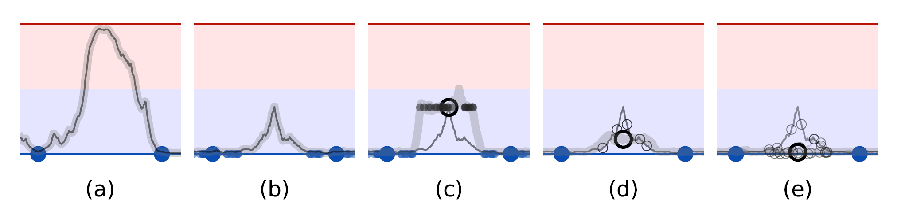
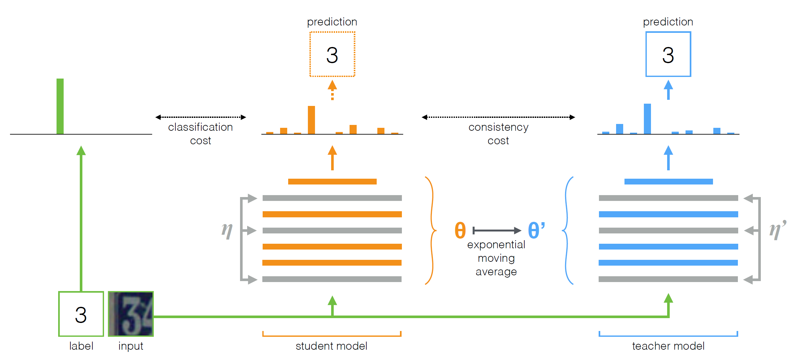

# Mean teachers are better role models: Weight-averaged consistency targets improve semi-supervised deep learning results

## 前置知识

- 当一个感知对象略微改变时，通常应认为其是同一个对象；
- 分类模型应该支持为相似数据点提供一致输出的函数；
- 实现方法是添加噪声；

##### 噪声相关

- 正则化模型不是在输入空间的零维数据点处最小化分类代价，而是在每个数据点周围的流形上最小化代价，从而将决策边界推离标记的数据点（如下图b）

- 没有正则化的模型可以自由地拟合任何能够很好地预测标记训练示例的函数
- 使用有噪声的标记数据（小点）训练的模型学习在标记数据点周围给出一致的预测
- 与未标记示例周围的噪波保持一致可提供额外的平滑。为清楚起见，首先将教师模型（灰色曲线）拟合到标记的示例，然后在训练学生模型期间保持不变。同样为了清楚起见，我们将省略图d和e中的小点
- 教师模型上的噪声减少了目标的偏差，无需额外培训。随机梯度下降的预期方向是朝向单个噪声目标（蓝色小圆圈）的平均值（蓝色大圆圈）。
-  一组模型给出了更好的预期目标。时间整合和平均教师法都使用这种方法

##### $\Gamma$​ model

- 由于未标记示例的分类代价是未定义的，因此噪声正则化本身不利于半监督学习。为了克服这一点，$\Gamma$​​模型评估每个数据点是否存在噪声，然后在两个预测之间应用一致性成本。在这种情况下，模型承担了教师和学生的双重角色。作为一名学生，它像以前一样学习；作为一名教师，它会生成目标，然后作为学生使用这些目标进行学习。

- 由于模型本身生成了目标，它们很可能是不正确的。如果对生成的目标赋予了太多的权重，则不一致性的代价将超过错误分类的代价，从而阻碍新目标的学习信息。实际上，该模型存在确认偏差（图c），这一风险可以通过提高目标质量来缓解。

- 仔细选择教师模型，而不是勉强复制学生模型

##### Temporal Ensembling

- 由于每个目标在每个Epoch中只更新一次，因此学习到的信息以缓慢的速度融入到训练过程中。
- 为了克服时间集成的局限性，我们建议平均模型权重而不是预测。 由于教师模型是连续学生模型的平均值，我们称之为平均教师方法

##### Mean Teacher

- 平均教师方法。 该图描绘了具有单个标记示例的训练批次。 学生和教师模型都在他们的计算中评估输入应用噪声$(\eta,\eta')$​。 将学生模型的 softmax 输出与使用分类成本的 one-hot 标签和使用一致性成本的教师输出进行比较。 在使用梯度下降更新学生模型的权重后，教师模型权重将更新为学生权重的指数移动平均值。 两种模型输出都可用于预测，但在训练结束时，教师预测更有可能是正确的。 带有未标记示例的训练步骤将是相似的，只是不应用分类成本

##### Consistency Cost

$$
J(\theta)=\mathbb{E}_{x, \eta^{\prime}, \eta}\left[\left\|f\left(x, \theta^{\prime}, \eta^{\prime}\right)-f(x, \theta, \eta)\right\|^{2}\right]
$$

we define $\theta_{t}^{\prime}$ at training step $t$ as the EMA of successive $\theta$​ weights:
$$
\theta_{t}^{\prime}=\alpha \theta_{t-1}^{\prime}+(1-\alpha) \theta_{t}
$$
where $\alpha$ is a smoothing coefficient hyperparameter.

