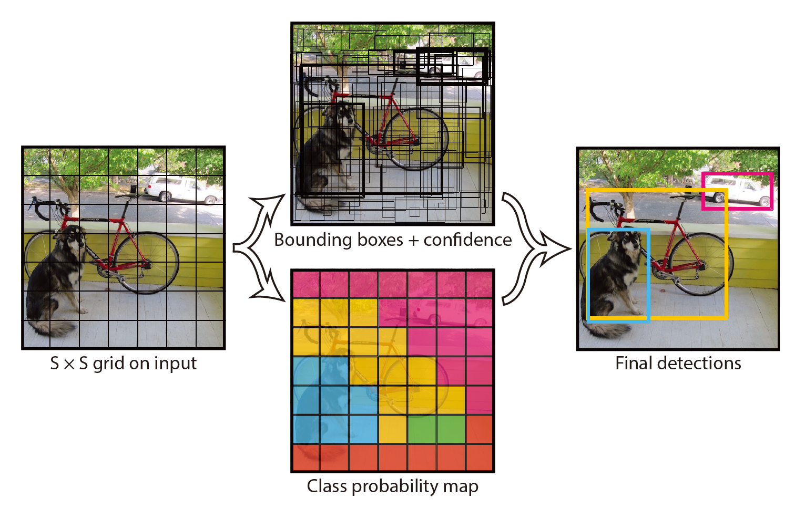

# YOLO: You Only Look Once

#### Unified, Real-Time Object Detection

- 将单个神经网络应用于完整图像。 该网络将图像划分为多个区域，并同时预测每个区域的边界框和概率。

- 基本YOLO模型以每秒45帧的速度实时处理图像，较小的网络Fast YOLO每秒可处理惊人的155帧；

- 与最新的检测系统相比，YOLO会产生更多的定位错误，但预测背景假阳性的可能性较小。

- 检测流程
  - 将输入图像的大小调整为448 448
  - 在图像上运行单个卷积网络
  - 通过模型的置信度对检测结果进行阈值化
- YOLO在准确性方面仍落后于最新的检测系统。 尽管它可以快速识别图像中的对象，但仍难以精确定位某些对象，尤其是小的对象。 

- 模型构造简单，可以直接在完整图像上进行训练。 与基于分类器的方法不同，YOLO在直接与检测性能相对应的损失函数上进行训练，并且整个模型都在一起进行训练。
- 快速YOLO是文献中最快的通用对象检测器，YOLO推动了实时对象检测的最新发展。  YOLO还很好地推广到了新领域，使其成为依赖快速，强大的对象检测的应用程序的理想选择。 