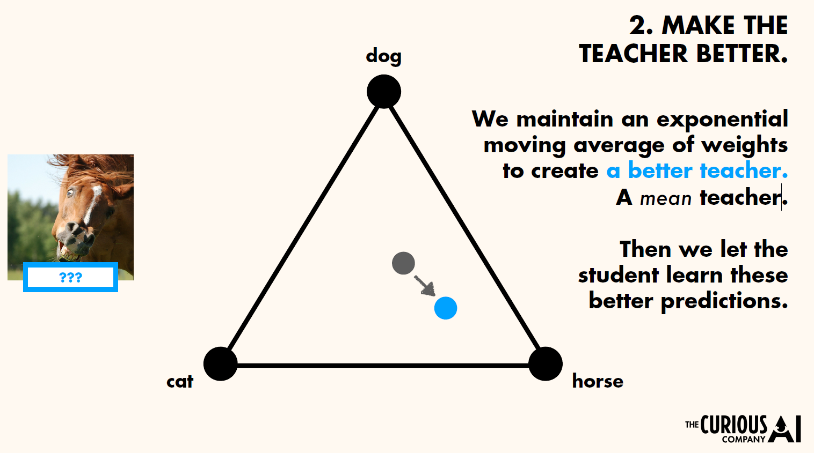

# 老师-学生网络

#### ——加权平均一致性目标可改善半监督式深度学习结果

在监督学习中，真实的标签会将模型的预测结果“拉向”真实结果；

而对于没有标签的目标，我们假设两个对象：**老师**和**学生**；我们希望这个学生可以从老师身上学到点什么；

操作步骤为：

第一步，通过扭曲**学生**的输入来让这个问题变得更难；然后，我们训练较难的任务，以预测较容易完成的任务的输出。

第二步，让老师变得更好；我们保持权重的**指数滑动平均**以创建更好的老师，即一个“平均值”老师；然后我们让学生学习更好的预测结果；

如此，学生和老师在一个良性循环中互相提高。

### Temporal Ensemble

对Input加噪声，输出的结果应该尽量的与原Input一致；换言之即Loss要小；

其中CrossEntropy项就是普通的预测与标签损失；而SquaredDifference是加噪声后与原图像的损失；

而老师网络则是把前几次的$z_i$做了滑动平均再比较；

孪生网络