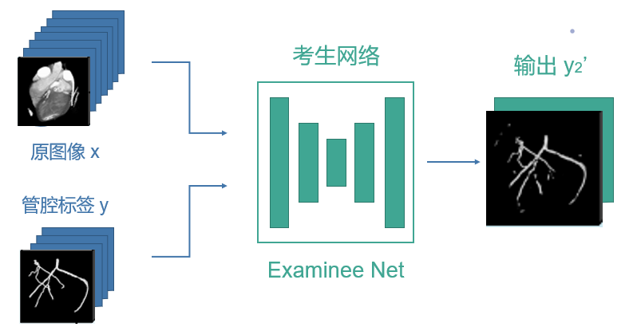

### 项目研究背景

​		心血管疾病是我国乃至世界最为严重的疾病之一。我国现有心血管病患病人数约2.9亿，并且还在逐年上升，而心血管疾病中，又以冠状动脉疾病最为常见。冠心病、心绞痛、心肌梗死等都属于冠脉疾病。除了死亡危险，冠状动脉疾病的高发病率和高致残率给社会、家庭和患者个人带来了沉重的经济负担和心理负担，其相关诊断和治疗受到医疗界的重视，国家和人民对此亦十分关注。如今，随着医学影像技术的发展进步，心脏成像已不再是难题，然而如何从医学影像图中准确提取冠状动脉以进行后续诊断仍是研究者持续关注的内容。

<b>图1 心脏CT图像</b>

​		人工诊断对于医生的能力和经验有相当高的要求。从图中可以看出，冠脉（箭头指向部分）在CT图像中的占比少，对比度低，就算经验丰富的医生也容易漏看或者看起来很困难，不仅诊断的时间成本较高，而且也难以达到精确。因此，在高精准度、高效率、自动化的发展趋势下，对冠脉疾病的自动化计算机辅助诊断的需求日益迫切。

​		如今，智能诊断已经成为了临床疾病诊断的发展趋势。作为智能诊断中重要也是主要的一部分，神经网络的设计和改进推动着对应诊断任务的发展。我们的考生-考官训练模型成功克服了医学图像数据集普遍存在的数据少、标签难获取等问题，在心脏冠脉分割任务上取得了令人满意的效果。由此进行推广，该模型也可以应用在其他的医学图像分割问题中，具有很大的发展和应用潜力。

​        我们的可视化应用程序使用门槛低，直观清晰，易于交互，作为辅助冠脉疾病诊断的工具可以很好的提高医生诊断的效率和精确度。对于医院和医生而言，可以降低成本、提升效率；对于患者而言，可以得到更加精准的诊断和及时的治疗，诊疗费用也会降低。综上所述，我们的作品在理论和实际领域都有较好的应用价值。

### 项目研究目标及主要内容

​		心脏CT图像不但能够反映解剖形态，而且包含大量心脏功能信息，因此利用CT图像对冠脉疾病进行临床诊断已成为当前主流方法之一。为提高其准确性和效率，本作品以心脏CT数据图像处理为主要研究内容，基于深度学习方法，重点研究冠状动脉的管腔分割等关键算法。我们采用创新性的网络结构训练神经网络进行自动冠脉分割，得到了良好的效果，并编写了可视化程序直观展示分割结果，以达到辅助诊断的目的。

### 项目创新特色概述

我们的项目特色主要分为两个部分：深度学习部分和可视化程序部分。

#### 深度学习部分

​        为了实现自动化的辅助诊断，我们采用了深度学习方法，希望训练出在CT图像冠脉分割任务上表现良好的神经网络。其中，由于训练网络需要已标注的训练集，但是医学CT图像训练集上标注困难，训练样本少，另有隐私保护等因素，这使得耗费大量时间和成本在人工标注上变得不现实。在缺少数据标签的情况下，传统的全监督训练方式难以给出令人满意的结果。于是，本作品基于用更少的数据标签训练的理念，采用了强弱监督结合的方式训练网络。同时，为了使得训练出的网络能够达到和标签充足的全监督相媲美的效果，我们从训练模型下手，提出了一种新的考生-考官训练模型（**Examinee-Examiner Network**）来训练网络。该模型的设计思路是通过考官网络对考生网络的评判和监督，加强考生网络的收敛能力，以此减少或抵消缺少数据标签的问题，并提高分割的精确度。

#### 可视化程序部分

​        神经网络训练完成后，为了将结果直观展示，我们设计并编写了对应的可视化程序CASeg（**Coronary artery segmentation**）。

<b>图2 CASeg程序界面截图</b>

​        如图所示，我们对原始的心脏CT数据进行建模，将CT断层图像还原成3D心脏图，使得没有CT阅片技能和经验的使用者也可以直观看到心脏的情况，降低了使用门槛。冠脉的标签也可以直接叠在心脏图像上显示；如果输入一张没有标签的原始心脏图片，利用训练好的神经网络就能直接对该图片进行预测，输出冠脉分割结果，叠加显示在图片上。我们设计程序的理念是将心脏CT图和冠脉标签进行建模，以更加方便快捷清楚地观察血管的情况，屏蔽掉周围其他的组织结构，从而进行进一步的诊断和规划，达到辅助诊断的目的。

###  项目研究技术路线

#### 神经网络部分：

​        鉴于精确的冠脉管腔标签稀少，我们希望用较少的标注数据训练出分割效果较好的神经网络。在前期的调研和学习中我们发现，对网络结构本身进行改变和创新带来的效果不大，于是我们尝试从训练模型下手，提出了一种新的考生-考官训练模型（**Examinee-Examiner Network**）来进行训练。在此模型中，考生网络是根据管腔标签对原心脏CT图像进行分割预测的主体；而考官网络负责学习管腔标签和高斯增强后中心线标签之间的映射关系，作为前提条件。在此基础上，经训练后的考官网络可用来评估考生网络的预测输出成果，并反馈至后者，达到监督训练考生网络的目的。

​        本项目所用神经网络都采用U-net的结构。U-net是一个在全卷积神经网络的基础上改进优化的网络结构，由特征提取收缩路径和上采样扩张路径组成，整体类似于英文字母U，因而得名。

<b>图3 U-net网络结构示意图</b>

​        由于医学图像语义简单、结构固定，高级语义信息和低级特征都很重要，而U-net通过底层信息和高层信息结合，能够显著提高分割的精度。根据训练需要，考生网络采用4层U-net，考官网络采用3层。训练时通过计算平衡交叉熵损失函数（**Balanced Cross-Loss**）来不断更新调整网络权重参数，从而训练网络提高分割结果的准确性。

**考官网络：**  我们发现，冠脉的中心线可以在一定程度上反映冠脉的走向、长度等特征，而且其标签相对容易获取。这给我们提供了思路，即将冠脉的中心线加入网络训练过程，以缓解冠脉管腔标签不足的问题，让网络能更好收敛。由于中心线过于细小，为了能让网络更好学习其特征，我们对其进行了高斯增强，得到高斯掩膜。在考官网络中，我们采用的是全监督学习，以冠脉管腔标签为输入，高斯增强的冠脉中心线信息为标签进行训练，计算损失函数并反馈，令其学习管腔拓扑结构的特征、管腔和中心线标签之间的映射关系。

<b>图4 考官网络示意图</b>

**考生网络：**考生网络就是我们期望得到的由心脏CT原图分割出冠脉管腔的网络。将心脏原图输入考官网络后，它的训练过程可以分为两个部分。第一个部分中，考生网络输出的结果将直接和冠脉标签计算Dice损失，将结果反馈。由于我们在考生网络的训练中采用的是弱监督，即训练图像多于标签图像，所以并不是每张心脏原图都存在对应的冠脉标签。如果该输入图像没有冠脉标签，就不进行第一部分的训练。第二个部分中，考生网络输出的冠脉分割结果将作为输入送到考官网络中，考官网络会提取出该冠脉分割结果的中心线，并和对应的中心线高斯掩膜计算损失。该损失同样会反馈给考生网络，使其更好地收敛。综上所述，考生网络结合了管腔分割特征训练和考官网络评估反馈，因此实现了效果较好的弱监督图像分割学习。

<b>图5 考生网络示意图</b>

<b>图6 考生-考官训练模型示意图</b>

​        综上所述，使用该模型训练相比以原图像作为输入、冠脉标注作为标签的全监督学习，所需标签训练集显著减少，同时也得到了令人满意的精确度，符合我们的设计理念。

#### 可视化程序部分：

为了验证算法的优越性，并将之应用于实际，我们将算法即整体流程封装，基于PyQt5+Mayavi 可视化平台，编写了”CASeg“可视化应用程序。程序包含“导入图片”、“查看3D 视图”、“查看2D 切片”、“查看图片标签”、“预测图片标签”、“保存预测标签”等功能模块，图像渲染清晰直观，可以让使用者清楚看到心脏冠脉管腔的位置、粗细等信息，而且能够对没有管腔标签的图片进行预测，可以作为辅助诊断的工具使用。

<b>图7 CASeg可视化应用程序展示</b>

具体操作流程为：

- 点击LoadData 按钮，选择训练样本图片.raw 文件，程序会自动从对应的文档读取支持文件；

- 点击View3D 按钮，程序会根据读入的数据绘制心脏3D 图；

- 点击ShowPredict 按钮，程序会根据训练样本和训练好的网络输出预测的冠脉分割结果，标记为红色；拖动界面中的图片，可以从不同角度预览3D 分割结果，并可进行缩放、旋转等操作；

- 点击ShowLabel 按钮，程序会绘制冠脉分割标签，标记为蓝色；

- 点击HidePredict 或者HideLabel 按钮，可以隐藏对应的分割结果，便于观察；

- 点击SaveFig 按钮，程序会将预览的结果保存到对应目录中，便于日后查阅；

- 点击ViewSlice 按钮，界面会绘制XYZ 方向的心脏三维切片图；通过鼠标拖动对应切片可以观察不同层次的图像结果；

  

<b>图8 GUI交互流程图</b>

### 研究进度安排

- 2021.4 ~ 2021.6 调研有关优化方向的论文，确定后续优化方向；
- 2021.7 ~ 2021.10 针对优化方向实现算法并测试修正；
- 2021.11 ~ 2021.12 基于优化后的算法封装可视化界面并优化更新；
- 2021.1 ~ 2021.4 总结整理项目文档形成成果；

### 项目组成员分工

- 陈喆鑫：统筹安排任务、GUI界面优化
- 郑滢：算法设计与实现、文档撰写
-   朱子衿：算法实现与优化、文档撰写

