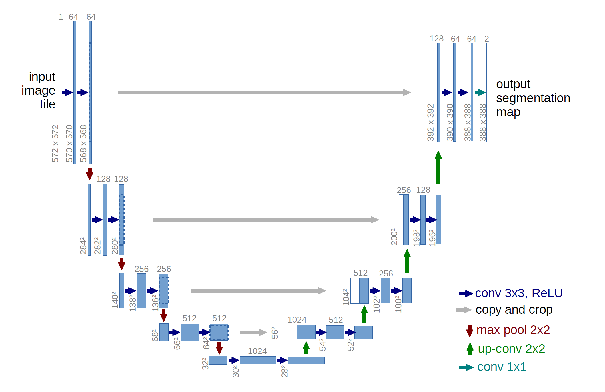

### 需求分析

   心血管疾病是我国乃至世界最为严重的疾病之一。我国现有心血管病患病人数约2.9亿，并且还在逐年上升，而心血管疾病中，又以冠状动脉疾病最为常见。冠心病、心绞痛、心肌梗死等都属于冠脉疾病。除了死亡危险，冠状动脉疾病的高发病率和高致残率给社会、家庭和患者个人带来了沉重的经济负担和心理负担，其相关诊断和治疗受到医疗界的重视，国家和人民对此亦十分关注。如今，随着医学影像技术的发展进步，心脏成像已不再是难题，然而如何从医学影像图中准确提取冠状动脉以进行后续诊断仍是研究者持续关注的内容。

​        人工诊断对于医生的能力和经验有相当高的要求。冠脉在CT图像中的占比少，对比度低，就算经验丰富的医生也容易漏看或者看起来很困难，不仅诊断的时间成本较高，而且也难以达到精确。因此，在高精准度、高效率、自动化的发展趋势下，对冠脉疾病的自动化计算机辅助诊断的需求日益迫切。心脏CT图像不但能够反映解剖形态，而且包含大量心脏功能信息，因此利用CT图像对冠脉疾病进行临床诊断已成为当前主流方法之一。为提高其准确性和效率，本作品以心脏CT数据图像处理为主要研究内容，基于深度学习方法，重点研究冠状动脉的管腔分割等关键算法。我们采用创新性的网络结构训练神经网络进行自动冠脉分割，得到了良好的效果，并编写了可视化程序直观展示分割结果，以达到辅助诊断的目的。

### 概要设计

ALSeg应用程序基础层级结构如下图所示：

### 详细设计

#### 界面设计

本项目基于QtPy5+Mayavi开发，程序包含“导入图片”、“查看3D 视图”、“查看2D 切片”、“查看图片标签”、“预测图片标签”、“保存预测标签”等功能模块，图像渲染清晰直观，可以让使用者清楚看到心脏冠脉管腔的位置、粗细等信息，而且能够对没有管腔标签的图片进行预测，可以作为辅助诊断的工具使用。

<b>图1 程序运行界面</b>

#### 关键算法

​		鉴于精确的冠脉管腔标签稀少，我们希望用较少的标注数据训练出分割效果较好的神经网络。在前期的调研和学习中我们发现，对网络结构本身进行改变和创新带来的效果不大，于是我们尝试从训练模型下手，提出了一种新的考生-考官训练模型（**Examinee-Examiner Network**）来进行训练。在此模型中，考生网络是根据管腔标签对原心脏CT图像进行分割预测的主体；而考官网络负责学习管腔标签和高斯增强后中心线标签之间的映射关系，作为前提条件。在此基础上，经训练后的考官网络可用来评估考生网络的预测输出成果，并反馈至后者，达到监督训练考生网络的目的。

​        本项目所用神经网络都采用U-net的结构。U-net是一个在全卷积神经网络的基础上改进优化的网络结构，由特征提取收缩路径和上采样扩张路径组成，整体类似于英文字母U，因而得名。

<b>图2 U-net网络结构示意图</b>

​        由于医学图像语义简单、结构固定，高级语义信息和低级特征都很重要，而U-net通过底层信息和高层信息结合，能够显著提高分割的精度。根据训练需要，考生网络采用4层U-net，考官网络采用3层。训练时通过计算平衡交叉熵损失函数（**Balanced Cross-Loss**）来不断更新调整网络权重参数，从而训练网络提高分割结果的准确性。

**考官网络：**  我们发现，冠脉的中心线可以在一定程度上反映冠脉的走向、长度等特征，而且其标签相对容易获取。这给我们提供了思路，即将冠脉的中心线加入网络训练过程，以缓解冠脉管腔标签不足的问题，让网络能更好收敛。由于中心线过于细小，为了能让网络更好学习其特征，我们对其进行了高斯增强，得到高斯掩膜。在考官网络中，我们采用的是全监督学习，以冠脉管腔标签为输入，高斯增强的冠脉中心线信息为标签进行训练，计算损失函数并反馈，令其学习管腔拓扑结构的特征、管腔和中心线标签之间的映射关系。

**考生网络：**考生网络就是我们期望得到的由心脏CT原图分割出冠脉管腔的网络。将心脏原图输入考官网络后，它的训练过程可以分为两个部分。第一个部分中，考生网络输出的结果将直接和冠脉标签计算Dice损失，将结果反馈。由于我们在考生网络的训练中采用的是弱监督，即训练图像多于标签图像，所以并不是每张心脏原图都存在对应的冠脉标签。如果该输入图像没有冠脉标签，就不进行第一部分的训练。第二个部分中，考生网络输出的冠脉分割结果将作为输入送到考官网络中，考官网络会提取出该冠脉分割结果的中心线，并和对应的中心线高斯掩膜计算损失。该损失同样会反馈给考生网络，使其更好地收敛。综上所述，考生网络结合了管腔分割特征训练和考官网络评估反馈，因此实现了效果较好的弱监督图像分割学习。

<b>图3 考生网络示意图</b>

​        综上所述，使用该模型训练相比以原图像作为输入、冠脉标注作为标签的全监督学习，所需标签训练集显著减少，同时也得到了令人满意的精确度，符合我们的设计理念。

### 测试报告

基于软件的功能进行测试，结果如下：

1.LoadData：点击LoadData按钮，选择训练样本图片.raw文件，程序会自动从对应的文档读取对应的支持文件，并将对应文件的路径及训练样本的尺寸显示在界面上。

2.ViewSlice：点击ViewSlice按钮，程序会绘制XYZ方向的心脏三维切片图。通过鼠标拖动对应切片可以观察不同层次的图像结果；加载完成后，下方会提示加载完成并输出加载时间。

3.View3D：点击ViewSlice按钮，程序会绘制XYZ方向的心脏三维切片图。通过鼠标拖动对应切片可以观察不同层次的图像结果；下方会提示加载完成并输出加载时间。

4.ShowPredict：点击ShowPredict按钮，程序会根据训练样本和训练好的网络输出预测的冠脉分割结果，标记为红色；程序下方会提示当前进度并输出运行时间。 

5.ShowLabel：点击ShowLabel按钮，程序会绘制冠脉分割标签，标记为蓝色。 

6.HidePredict/HideLabel：点击HidePredict或者HideLabel按钮，可以隐藏对应的分割结果，便于观察。

7.SaveFig：点击SaveFig按钮，程序会将预览的结果以.raw格式保存到对应目录中，便于日后查阅。

本软件运行速度较快，通过神经网络预测并绘图时间一般在20s内；同时基于Python平台开发，可扩展性和可部署性强，只需安装相应的库环境即可运行；

### 安装和使用

整体软件无需安装，只需要在配置好Python环境支持库后直接运行：

#### 环境配置

Python版本 3.7.7

IDE PyCharm 2020.3.2 (Community Edition)

PyQt5 5.15.1

Mayavi 4.7.2

pytorch 1.8.0

#### 运行说明

./Codes/Data/background 裁剪后的心脏图片 用于可视化

./Codes/Data/image 未裁剪的心脏图片 用于训练

./Codes/Data/label 标签 用于训练

./Codes/Data/npy 图片的shape文件

./Codes/Data/predict 生成的预测图片

**运行时需要保证同一个样本的所有对应文件名相同**

如：

./Codes/Data/background/1.raw

./Codes/Data/image/1.raw

./Codes/Data/label/1.raw

./Codes/Data/npy/1.npy

./Codes/Data/predict/1.raw

#### 使用流程

- 点击LoadData 按钮，选择训练样本图片.raw 文件，程序会自动从对应的文档读取支持文件；
- 点击View3D 按钮，程序会根据读入的数据绘制心脏3D 图；
- 点击ShowPredict 按钮，程序会根据训练样本和训练好的网络输出预测的冠脉分割结果，标记为红色；拖动界面中的图片，可以从不同角度预览3D 分割结果，并可进行缩放、旋转等操作；
- 点击ShowLabel 按钮，程序会绘制冠脉分割标签，标记为蓝色；
- 点击HidePredict 或者HideLabel 按钮，可以隐藏对应的分割结果，便于观察；
- 点击SaveFig 按钮，程序会将预览的结果保存到对应目录中，便于日后查阅；
- 点击ViewSlice 按钮，界面会绘制XYZ 方向的心脏三维切片图；通过鼠标拖动对应切片可以观察不同层次的图像结果；

### 项目总结

#### 后续工作

基于目前的开发进度，本软件后续还可作以下优化：

- 功能优化：移动鼠标调整亮度、在鼠标所在坐标位置显示亮度参数等等；

- 视图优化： 界面上会添加新的视图，包括图像的XY 切面、XZ 切面、YZ 切面、和3D 图像展示，便于观察比对；

- 运行速度优化：我们将尝试多线程非阻塞加载原图、标签的方法，并采用降采样的方法，优化运行速度，防止界面意外卡死。

- 后处理：利用连通域相关算法，对图像与标签做后处理，从而排除网络误分割部分，达到更好的显示效果。

最后，根据工作需要添加功能，实现医学图像处理的自动化、高度可视化，增强软件的普适性，从而提高用户的工作效率和体验。

#### 感悟

在GUI的开发过程中，遇到了许多知识上的、工程上的困难；但在解决这些困难的过程中也锻炼了我们的信息检索能力和解决问题能力，最后对软件做细致的打磨优化从而形成成品。虽然过程并不轻松，但我们也收获了许多。